# Hardware
{:.no_toc}

* TOC
{:toc}

## Biner

- Kita menggunakan komputer setiap hari
- Di dalam sebuah komputer adalah "0 dan 1"
  - Komputer menggunakan sistem angka biner untuk merepresentasikan informasi
    - Bagaimana komputer merepresentasikan informasi hanya dengan biner?
- Pikirkan angka desimal (yang kita manusia sering gunakan) 123
  - Kolom paling kanan adalah kolom 1an
  - Yang tengah, 10an
  - Yang paling kiri, 100an

    |100an| 10an|  1an|
    |:--:|:--:|:--:|
    |1  |2  |3  |

  - Sehingga kita memiliki 100 x 1 + 10 x 2 + 1 x 3 = 100 + 20 + 3 = 123
- Dalam sebuah komputer, biner 000 akan merepresentasikan 0, sama seperti di kehidupan manusia!
  - Namun, dalam kasus ini kita menghadapi biner sehingga:
    - Kolom paling kanan adalah posisi 1an
    - Yang tengah, 2an
    - Yang paling kiri, 4an

    |4| 2|  1|
    |:--:|:--:|:--:|
    |0  |0  |0  |

  - Dalam dunia manusia (desimal) kita menggunakan pangkat dari 10 untuk nilai setiap posisi
    - 100 = 1, 101 = 10, 102 = 100, 103 = 1000, dst.
  - Dalam dunia komputer (biner) kita menggunakan pangkat dari 2 untuk nilai setiap posisi
    - 20 = 1, 21 = 2, 22 = 4, 23 = 8, dst.
  - Perbedaan dari angka desimal dan angka biner adalah perbedaan basis angkanya
  - Untuk angka biner 000, kita mimiliki 4 x 0 + 2 x 0 + 1 x 0 = 0 + 0 + 0 = 0
- Pikirkan angka biner 001:

  |4| 2|  1|
  |:--:|:--:|:--:|
  |0  |0  |0  |

  - Kita memiliki 4 x 0 + 2 x 0 + 1 x 1 = 0 + 0 + 1 = 1
- Bagaimana kita merepresentasikan angka desima 2 dalam biner?
  - Kita tidak membutuhkan 4, namun kita membutuhkan 2, dan tidak membutuhkan 1

  |4| 2|  1|
  |:--:|:--:|:--:|
  |0  |1  |0  |

  - Kita mendapatkan 4 x 0 + 2 x 1 + 1 x 0 = 0 + 2 + 0 = 2
- begitu juga, angka 3 akan menjadi:

  |4| 2|  1|
  |:--:|:--:|:--:|
  |0  |1  |1  |

  - Karena kita membutuhkan 2 dan 1
  - Jadi, 4 x 0 + 2 x 1 + 1 x 1 = 0 + 2 + 1 = 3
- Demikian pula, 4 akan menjadi:

  |4| 2|  1|
  |:--:|:--:|:--:|
  |1  |0  |0  |

- Bagaimana dengan 7?

  |4| 2|  1|
  |:--:|:--:|:--:|
  |1  |1  |1  |

  - Yang menghasilkan 4 x 1 + 2 x 1 + 1 x 1 = 4 + 2 + 1 = 7
- Bagaimana dengan 8?
  - Kita tidak dapat menghitung sampai 8 tanpa menambah bit (*binary digit* / digit biner) lain
    - Kita juga mengalami hal ini di dunia nyata jika kita membutuhkan angka empat digit vs angka 3 digit
      - Mulai dari 1an, 10an, 100an, dan tambah 1000an
    - Di sini kita akan menambahkan pangkat dari 2 selanjutnya, 8

    |8|4| 2|  1|
    |:--:|:--:|:--:|:--:|
    |1  |0  |0  |0  |

    - 8 x 1 + 4 x 0 + 2 x 0 + 1 x 0 = 8
- Sama seperti angka desimal (basis 10), angka mewakili nilai yang lebih besar dari sisi kiri dan berkurang ketika kita bergerak ke kanan.
- jadi jika kita ingin membandingkan angka-angka biner 1001 dan 1010 kita bisa mulai dari sisi angka paling kiri dan mencari di mana angka-angka tersebut berbeda.
  - Sama seperti desimal, dimana 10an lebih besar dari 1an
    - Dalam biner, 2an lebih besar dari 1an

    |8|4|2|1|
    |:--:|:--:|:--:|:--:|
    |1|0|**_0_**|1|
    |1|0|**_1_**|0|

- Meskipun komputer hanya menggunakan biner, mereka dapat menghitung setinggi kemampuan manusia!
  - Mereka melakukannya dengan kosakata yang lebih kecil, 1 dan 0.
    - Ini karena lebih mudah merepresentasikan dua keadaan di dunia fisik
      - Jika Anda berpikir salah satu dari bit ini seperti lampu:
        - 0 adalah mati
        - 1 adalah nyala
      - Lampu hanya membutuhkan listrik untuk menyala dan mati
      - Listrik cukup untuk menghidupkan atau mematikan sakelar
        - Di dalam komputer ada sakelar yang disebut transistor
          - Komputer modern punya milyaran!
          - Dimatikan mewakili 0
          - Dinayalan mewakili 1
- Menggunakan transistor ini kita dapat menyimpan nilai, menyimpan data, berhitung, dan melakukan semua yang kita bisa dengan komputer
- So far all that we can represent is numbers
  - A decision needs to be made on what pattern of 1s and 0s to represent letters, words, and paragraphs
  - All computers can store is 0s and 1s
  - To represent letters, we need a mapping of 0s and 1s to characters
    - ASCII (American Standard Code for Information Interchange) does this

    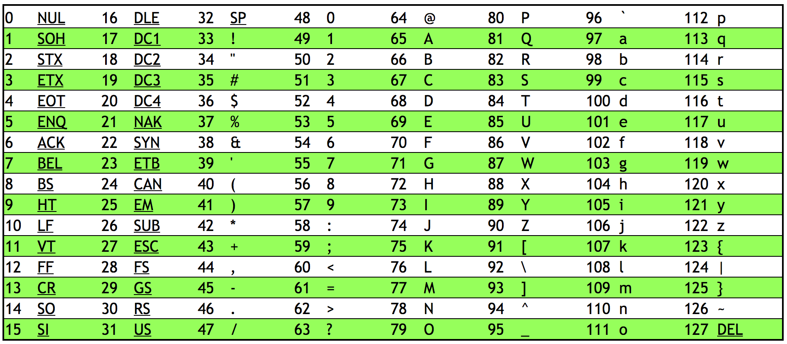

    - 65 -> A, 66 -> B, 67 -> C, etc.
    - 97 -> a, 98 -> b, 99 -> c, etc.
    - ASCII also has mapping for punctuation symbols
  - Programs like notepad, textedit, and MicroSoft Word decide weather to display patterns of bits as letters or words
    - Computers only store 0s and 1s, but the programs interpret those bits in a certain way
      - For example, if MicroSoft word sees a pattern of buts representing the number 65, it will interpret that as "A"
  - ASCII is limited
    - Original ASCII is 7 bits, thus giving 128 characters
      - Extended ASCII is 8 bits, yielding 256 characters
    - Many symbols are not represented
  - UNICODE is a bigger set of characters that includes written languages other than English and even emoji! 😲
    - All are still represented by a pattern of bits
- Consider this pattern of bits: 01001000 01001001
  - 16 bits or 2 bytes (1 byte = 8 bits)

  |128|64|32|16|8|4|2|1| |128|64|32|16|8|4|2|1|
  |:--:|:--:|:--:|:--:|:--:|:--:|:--:|:--:|:--:|:--:|:--:|:--:|:--:|:--:|:--:|:--:|:--:|
  |0  |1  |0  |0  |1  |0  |0  |0  |  |0  |1  |0  |0  |1  |0  |0  |1 |

  | 1 x 64 + 1 x 8 | 1 x 64 + 1 x 8 + 1 x 1|
  |:--:|:--:|
  | 72 | 73 |
  | H | I |

  - Using ASCII we get the word "HI"

## CPU

- If you have heard that your computer has "Intel Inside," it has an Intel processor in it

  

  - The backside of the processor has pins that connect into the motherboard
- The motherboard is a circuit board made of silicon
- The CPU is the brain of the computer
  - Does all the thinking
  - Performs math in numbers fed to it
  - Helps display numbers on a screen
  - Adds or deletes numbers
- CPUs now can have multiple cores
  - Cores are the devices inside the CPU that can preform mathematical operations, load info from memory, save info to memory, etc.
  - The more cores, the more tasks a CPU can do at once
- CPUs now also support hyper-threading
  - Where a single core will present itself as multiple cores to a computer's operating system
- Systems on a Chip (SoaC) are when a CPU and more are all interconnected at once rather than attached to a motherboard
  - Popular in phones, tables, and game consoles
  - Raspberry Pi

    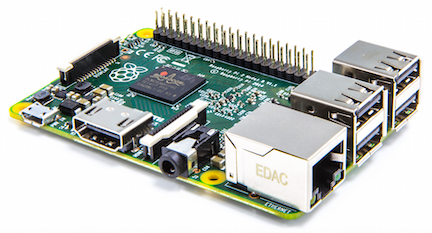

## RAM (Random Access Memory)
- Circuit board with chips that slides into a slot on the motherboard

  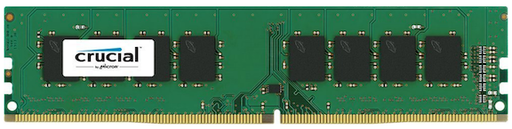
  - The chips store data
    - Only stores data when the power is on
  - Files and programs are loaded onto these chips when ran
  - Fast memory
- You can check your RAM and other specs:
  - Windows Task Manager

    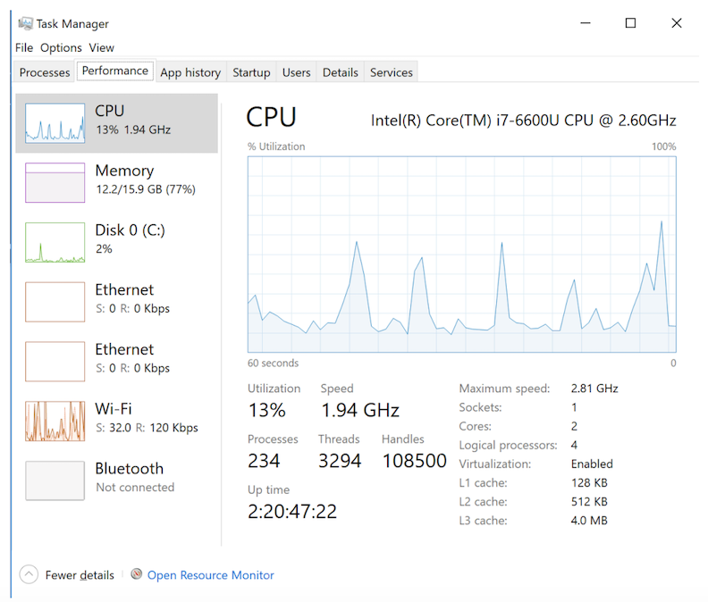
    - CPU chart shows when peak usage occurs
    - GHz is the number of operations a CPU can perform per second (in billions)
      - 1.94 GHz = 1.94 billion operations per second
    - Logical processors in this case is 4, which means both cores support hyper-threading
      - Each core will do two things at once as if 4 cores exist
  - Mac System Profiler

    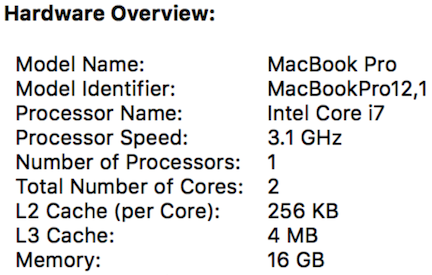

## Hard Drives

- When you turn a computer off, you need a place to store data
  - A hard disk drive (HDD) stores this information

    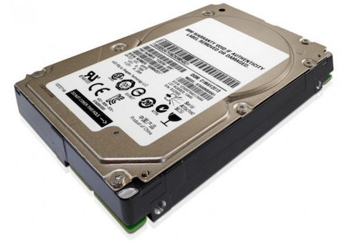
  - RAM may store 1 GB, 2 GB, 4 GB, through 16 GB or so
  - HDD stores 256 GB, 1024 GB (AKA terabyte or TB), 2 TB
  - Inside a HDD, metal platters physically spin around

    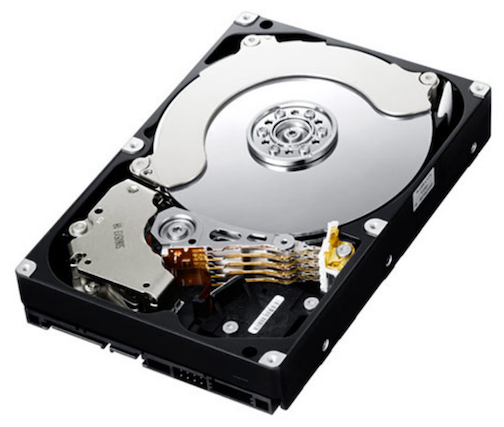

      - Data is stored on these disks
      - The reading heads move back and forth reading data from the device
      - Uses tiny magnetic particles where north pole orientation represents 1 and south pole orientation represents 0
        - Power is only needed to read or change the data
          - Data is preserved when power is off
      - David shows a video of a HDD running in slowmo
- To store data in a hard drive, RAM sends data and instructions to the HDD
  - The hard drive translates that data into voltage fluctuations
    - Some signals spin the platters, others move the read/write heads
    - Pulses sent to the read/write head turn on a magnet which creates a field that changes the polarity of a tiny portion of the metal platter's surface
    - Power is sent in different directions as to change polarity
  - To read, the particles on the disk use their charge to move the read/write head.
  - Pieces of a file can be spread out around the platters
    - A special file keeps track of data's location
  - Anytime you have a physical device that moves over a period of time, things go wrong
    - Dropping a HDD can corrupt files
  - Platters spin slower than how fast electrons move

## Flash Memory

- Solid state disk (SSD)

  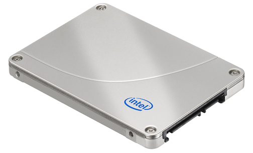
  - Smaller (3.5 inch width for HDD vs 2.5 inch width for SSD)
    - Still fits where old HDDs are
  - No moving particles
  - Inside, it looks a lot like RAM

    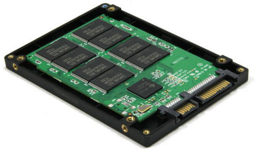
  - Much faster than HDD
    - Programs/files load and save more quickly
  - SSD theoretically don't last as long as HDD
    - Finite number of writes
- Hybrid Drives
  - Some GB of solid state memory and more GB or TB of HDD space
  - Stores as much of frequently-needed data on the SSD
  - Stores less frequently-needed data on HDD
- Flash memory also exists in the form of USB sticks
  - Might store 1 GB, 16 GB, or more
  - Portable
- External SSDs exist for more storage
  - Might store 256 GB or more
  - Can be used to share data with others without network usage
- Can also have external HDD

## Types of Memory and Funneling

- There is a tradeoff between space, money, and speed of data transfer

  
  - Data is pushed "down the funnel" to your CPU
    - From the hard drive, data first goes to the RAM

      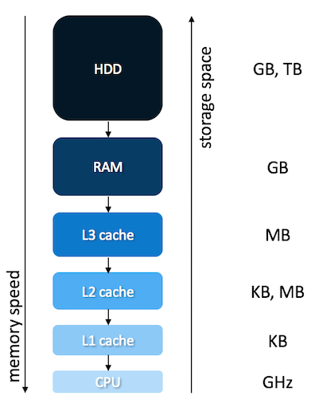

    - Theoretically, the CPU never has to wait for data to crunch
    - There is a tiny amount of memory (bytes) called registers where numbers are stored for operations.
    - Memory at the bottom is more expensive
    - Disk is important for the long-term storage
    - RAM is important as it stores programs you use simultaneously
    - L3, L2, L1 cache are on the motherboard
- As an analogy for memory, picture a candy store
  - A customer approaches the counter and requests candy
  - The shop owner then leaves the counter to grab the candy before returning moments later
    - Not super efficient to walk all the way to the store room to grab candy
      - Better to have a cache of memory
  - Instead, the shop owner leaves the counter to ready a cache of candy before the customers arrive
  - When a customer comes, the candy can be distributed quickly
    - Cache memory similarly helps the CPU in this manner
- We can see sizes of cache looking at computer specs like before

## Display Connectors

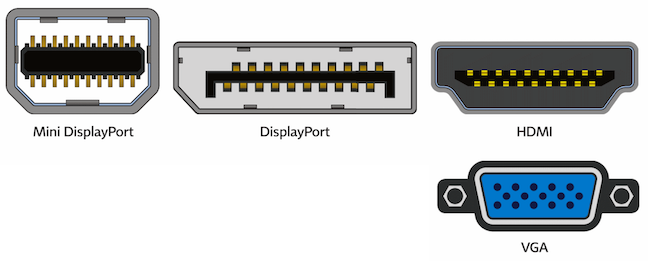

- These sockets all connect to monitors or displays
- Mini DisplayPort are used form monitors
- HDMI is not only on laptops and computers but also TVs
- VGA is older, but still commonly uses on projectors

## USB (Universal Serial Bus)

- Can plug in a whole range of peripheral devices including printers, keyboards, mice, scanners, etc.
- USB-A most common
- USB-B is often used for printers and scanners
- USB-C is newer and can be plugged in coming from different directions
- Other variants often exist for phones
- Older USB connections are slower when transferring data
  - Hard drives can connect via USB
    - Even if a hard drive is fast, if the USB is slow, the transfer of data will be slow

## Wireless

- Wifi is wireless internet
- Bluetooth allows devices such as wireless keyboards and headphones to connect to your computer
  - Limited range
    - This is ok as it is used for you to connect to your own device

## Operating System (OS)

- Software that ensures all devices work and can intercommunicate
- MacOS and Windows are popular OS
- Can be installed by the user, but is typically done so by a manufacturer
  - Installed on HDD or SDD so that it exists persistently without power
- When you hit power on your computer, the OS is loaded into RAM
- Gives you the graphical interface that you see
- Knows how to:
  - Talk to your keyboard and mouse
  - Display info on the screen
  - Move things around in memory
- This is all thanks to device drivers installed with the OS
  - Special software designed to talk to certain model of printer, camera, scanner, etc.
- When an OS doesn't recognize a device, perhaps because it's too new, you can download new device drives from the device manufacturer
  - Teaches Window, MacOS, or Linux about that new hardware
  - Future-proofing structure
- It's this intersection of hardware and software that makes computers powerful!

## Looking Underneath the Hood

- David and Colton Ogden look at the exterior of an old ThinkPad computer, examining ports
  - Power bricks convert power from the wall into safe amounts for the computer
- David and Colton examine the inside of an old window desktop, highlighting the motherboard, heatsink, RAM, Hard Drive, etc.
- David and Colton then look inside a HDD
  - Once exposed to air and dust, it's no longer reliable enough to use
- David and Colton then look at a motherboard examining all the ports on it
