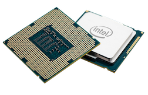

# Hardware
{:.no_toc}

* TOC
{:toc}

## Biner

- Kita menggunakan komputer setiap hari
- Di dalam sebuah komputer adalah "0 dan 1"
  - Komputer menggunakan sistem angka biner untuk merepresentasikan informasi
    - Bagaimana komputer merepresentasikan informasi hanya dengan biner?
- Pikirkan angka desimal (yang kita manusia sering gunakan) 123
  - Kolom paling kanan adalah kolom 1an
  - Yang tengah, 10an
  - Yang paling kiri, 100an

    |100an| 10an|  1an|
    |:--:|:--:|:--:|
    |1  |2  |3  |

  - Sehingga kita memiliki 100 x 1 + 10 x 2 + 1 x 3 = 100 + 20 + 3 = 123
- Dalam sebuah komputer, biner 000 akan merepresentasikan 0, sama seperti di kehidupan manusia!
  - Namun, dalam kasus ini kita menghadapi biner sehingga:
    - Kolom paling kanan adalah posisi 1an
    - Yang tengah, 2an
    - Yang paling kiri, 4an

    |4an| 2an|  1an|
    |:--:|:--:|:--:|
    |0  |0  |0  |

  - Dalam dunia manusia (desimal) kita menggunakan pangkat dari 10 untuk nilai setiap posisi
    - 100 = 1, 101 = 10, 102 = 100, 103 = 1000, dst.
  - Dalam dunia komputer (biner) kita menggunakan pangkat dari 2 untuk nilai setiap posisi
    - 20 = 1, 21 = 2, 22 = 4, 23 = 8, dst.
  - Perbedaan dari angka desimal dan angka biner adalah perbedaan basis angkanya
  - Untuk angka biner 000, kita mimiliki 4 x 0 + 2 x 0 + 1 x 0 = 0 + 0 + 0 = 0
- Pikirkan angka biner 001:

  |4| 2|  1|
  |:--:|:--:|:--:|
  |0  |0  |1  |

  - Kita memiliki 4 x 0 + 2 x 0 + 1 x 1 = 0 + 0 + 1 = 1
- Bagaimana kita merepresentasikan angka desimal 2 dalam biner?
  - Kita tidak membutuhkan 4, namun kita membutuhkan 2, dan tidak membutuhkan 1

  |4| 2|  1|
  |:--:|:--:|:--:|
  |0  |1  |0  |

  - Kita mendapatkan 4 x 0 + 2 x 1 + 1 x 0 = 0 + 2 + 0 = 2
- begitu juga, angka 3 akan menjadi:

  |4| 2|  1|
  |:--:|:--:|:--:|
  |0  |1  |1  |

  - Karena kita membutuhkan 2 dan 1
  - Jadi, 4 x 0 + 2 x 1 + 1 x 1 = 0 + 2 + 1 = 3
- Demikian pula, 4 akan menjadi:

  |4| 2|  1|
  |:--:|:--:|:--:|
  |1  |0  |0  |

- Bagaimana dengan 7?

  |4| 2|  1|
  |:--:|:--:|:--:|
  |1  |1  |1  |

  - Yang menghasilkan 4 x 1 + 2 x 1 + 1 x 1 = 4 + 2 + 1 = 7
- Bagaimana dengan 8?
  - Kita tidak dapat menghitung sampai 8 tanpa menambah bit (*binary digit* / digit biner) lain
    - Kita juga mengalami hal ini di dunia nyata jika kita membutuhkan angka empat digit vs angka 3 digit
      - Mulai dari 1an, 10an, 100an, dan tambah 1000an
    - Di sini kita akan menambahkan pangkat dari 2 selanjutnya, 8

    |8|4| 2|  1|
    |:--:|:--:|:--:|:--:|
    |1  |0  |0  |0  |

    - 8 x 1 + 4 x 0 + 2 x 0 + 1 x 0 = 8
- Sama seperti angka desimal (basis 10), angka mewakili nilai yang lebih besar dari sisi kiri dan berkurang ketika kita bergerak ke kanan.
- jadi jika kita ingin membandingkan angka-angka biner 1001 dan 1010 kita bisa mulai dari sisi angka paling kiri dan mencari di mana angka-angka tersebut berbeda.
  - Sama seperti desimal, dimana 10an lebih besar dari 1an
    - Dalam biner, 2an lebih besar dari 1an

    |8|4|2|1|
    |:--:|:--:|:--:|:--:|
    |1|0|**_0_**|1|
    |1|0|**_1_**|0|

- Meskipun komputer hanya menggunakan biner, mereka dapat menghitung setinggi kemampuan manusia!
  - Mereka melakukannya dengan kosakata yang lebih kecil, 1 dan 0.
    - Ini karena lebih mudah merepresentasikan dua keadaan di dunia fisik
      - Jika Anda berpikir salah satu dari bit ini seperti lampu:
        - 0 adalah mati
        - 1 adalah nyala
      - Lampu hanya membutuhkan listrik untuk menyala dan mati
      - Listrik cukup untuk menghidupkan atau mematikan sakelar
        - Di dalam komputer ada sakelar yang disebut transistor
          - Komputer modern punya milyaran!
          - Dimatikan mewakili 0
          - Dinayalan mewakili 1
- Menggunakan transistor ini kita dapat menyimpan nilai, menyimpan data, berhitung, dan melakukan semua yang kita bisa dengan komputer
- Sejauh ini yang bisa kita wakili hanyalah angka
  - Keputusan dan kesepakatan harus dibuat tentang pola 1 dan 0 yang mewakili huruf, kata, dan paragraf
  - Yang dapat disimpan komputer hanyalah 0 dan 1
  - Untuk merepresentasikan huruf, kita membutuhkan pemetaan 0 dan 1 ke karakter
    - ASCII (American Standard Code for Information Interchange) adalah salah satunya

    

    - 65 -> A, 66 -> B, 67 -> C, etc.
    - 97 -> a, 98 -> b, 99 -> c, etc.
    - ASCII memiliki pemetaan untuk simbol tanda baca
    - ASCII juga memiliki pemetaan untuk *control character*
      - *Control character* tidak merepresentasikan simbol
        - 9 (HT) digunakan untuk memberikan tab
        - 10 (LF) digunakan untuk memberikan baris baru (enter)
        - 32 (SP) digunakan untuk memberikan spasi
  - Program seperti notepad, textedit, dan Microsoft Word memutuskan apakah akan menampilkan pola bit sebagai huruf atau kata
    - Komputer hanya menyimpan 0 dan 1, tetapi program menafsirkan bit-bit itu dengan cara tertentu
      - Misalnya, jika Microsoft Word melihat pola bits yang mewakili angka 65, dia akan menafsirkannya sebagai "A"
  - ASCII terbatas
    - ASCII original panjangnya 7 bits, sehingga hanya dapat memberikan 128 karakter
      - ASCII yang diperluas panjangnya 8 bits, menghasilkan 256 karakter
    - Banyak simbol yang tidak dapat direpresentasikan
  - UNICODE adalah serangkaian karakter yang lebih besar yang mencakup huruf tertulis selain romawi dan bahkan emoji! 😲
    - Semuanya masih direpresentasikan dengan pola bits
- Pikirikanlah pola bits berikut: 01001000 01001001
  - 16 bits atau 2 bytes (1 byte = 8 bits)

  |128|64|32|16|8|4|2|1| |128|64|32|16|8|4|2|1|
  |:--:|:--:|:--:|:--:|:--:|:--:|:--:|:--:|:--:|:--:|:--:|:--:|:--:|:--:|:--:|:--:|:--:|
  |0  |1  |0  |0  |1  |0  |0  |0  |  |0  |1  |0  |0  |1  |0  |0  |1 |

  | 1 x 64 + 1 x 8 | 1 x 64 + 1 x 8 + 1 x 1|
  |:--:|:--:|
  | 72 | 73 |
  | H | I |

  - Menggunakan ASCII kita mendapatkan kata "HI"

## CPU (Central Processing Unit)

- Jika Anda pernah mendengar bahwa komputer Anda memiliki "Intel Inside", didalamnya ada processor Intel

  

  - Di bagian belakang dari prosesor ada pin yang terkoneksi ke motherboard
- Motherboard adalah papan sirkuit yang terbuat dari silikon
- CPU adalah otak dari komputer
  - Melakukan semua pemikiran
  - Melakukan perhitungan dengan angka yang dimasukkan kedalamnya
  - Membantu menampilkan angka pada layar
  - Menambah atau mengurangi angka
- CPU saat ini memiliki beberapa core
  - Core adalah perangkat di dalam CPU yang dapat melakukan operasi matematika, memuat informasi dari memori, menyimpan informasi ke memori, dsb.
  - Semakin banyak core, semakin banyak tugas yang dapat dilakukan CPU dalam waktu bersamaan
- CPU saat ini juga mendukung hyper-threading
  - Ketik satu core akan terlihat sebagai beberapa core pada sistem operasi komputer
- Systems on a Chip (SoaC) adalah ketika CPU dan lainnya saling terhubung dalam satu paket chip daripada melekat terpisah di motherboard
  - Populer di ponsel, tablet, dan konsol game
  - Raspberry Pi

    

## RAM (Random Access Memory)
- Papan sirkuit dengan chip yang diselipkan pada slot yang ada pada motherboard

  

  - Chip tersebut menyimpan data
    - Hanya menyimpan data ketika listrik menyala
  - File dan program dimuat ke dalam chip tersebut ketika dijalankan
  - Memori yang cepat
- Anda dapat melihat RAM dan spesifikasi lainnya:
  - Windows Task Manager

    

    - Bagan CPU menunjukkan kapan penggunaan puncak terjadi
    - GHz adalah jumlah operasi yang dapat dilakukan CPU per detik (dalam milyaran)
      - 1.94 GHz = 1.94 milyar operasi per detik
    - *Logical processors* dalam kasus ini ada 4, yang maksudnya setiap core mendukung hyper-threading
      - Tiap core akan melakukan dua hal sekaligus seakan-akan terdapat 4 core
  - Mac System Profiler

    

## Hard Drives

- Ketika komputer dimatikan, Anda butuh tempat untuk menyimpan data
  - *Hard disk drive* (HDD) menyimpan informasi tersebut

    

  - RAM mungkin menyimpan 1 GB, 2 GB, 4 GB, hingga 16 GB dan seterusnya
  - HDD menyimpan 256 GB, 1024 GB (juga dikenal sebagai terabyte or TB), 2 TB, dan seterusnya
  - Di dalam HDD, adalah plat logam yang secara fisik berputar

    

      - Data disimpan di piringan ini
      - Kepala pembaca bolak-balik membaca data dari perangkat
      - Menggunakan partikel magnetik kecil di mana orientasi kutub utara mewakili 1 dan orientasi kutub selatan mewakili 0
        - Listrik hanya dibutuhkan saat membaca atau mengubah data
          - Data disimpan ketika daya dimatikan
      - Guru memperlihatkan video bagaimana HDD berputar dalam gerakan lambat
- Untuk menyimpan data dalam hard drive, RAM mengirim data dan perintah ke HDD
  - Hard drive menerjemahkan data itu menjadi fluktuasi tegangan
    - Ada sinyal yang memutar piringan logam, sinyal yang lain memindahkan kepala baca / tulis
    - Sinyal yang dikirim ke kepala baca / tulis nyalakan magnet yang menciptakan bidang yang mengubah polaritas sebagian kecil permukaan pelat logam
    - Daya dikirim ke berbagai arah untuk mengubah polaritas
  - Untuk membaca, partikel pada disk dibaca muatannya dengan menggerakkan kepala baca / tulis
  - Potongan-potongan file dapat tersebar di sekitar piringan
    - File khusus melacak lokasi data
  - Kapan pun Anda memiliki perangkat fisik yang bergerak dalam periode waktu tertentu, ada kemungkinan kesalahan terjadi
    - Menjatuhkan HDD dapat merusak file
  - Piring berputar lebih lambat dari seberapa cepat elektron bergerak

## Flash Memory

- Solid state disk (SSD)

  

  - Lebih kecil (lebar 3.5 inci untuk HDD vs lebar 2.5 inci untuk SSD)
    - Masih cocok dengan HDD lama
  - Tidak ada partikel yang bergerak
  - Di dalam, sangat mirip RAM

    

  - Jauh lebih cepat dari HDD
    - Program / file dimuat dan disimpan lebih cepat
  - SSD secara teoritis tidak bertahan selama HDD
    - Jumlah penulisan data yang terbatas
- *Hybrid Drives*
  - Beberapa GB memori solid state dan lebih banyak GB atau TB ruang HDD
  - Menyimpan sebanyak mungkin data yang sering diakses pada SSD
  - Menyimpan data yang lebih jarang dibutuhkan pada HDD
- Memori flash juga ada dalam bentuk stik USB
  - Mungkin menyimpan 1 GB, 16 GB, atau lebih
  - Portable, praktis dibawa kemana-mana
- HDD eksternal juga tersedia untuk penyimpanan lebih besar
  - Mungkin menyimpan 256 GB atau lebih
  - Dapat digunakan untuk berbagi data dengan orang lain menggunakan USB
- NAS, *Network Attached Storage*, dapat diakses menggunakan jaringan internet di dalam rumah atau kantor
  - Memudahkan akses dari beberapa perangkat sekaligus menggunakan kabel jaringan atau wifi

## Tipe Memori dan Pencorongan

- Ada yang harus dikorbankan antara ruang, uang, dan kecepatan transfer data

  

  - Data ditemakn "masuk ke corong" menuju CPU Anda
    - Dari hard drive, data pertama masuk ke RAM

      

    - Secara teori, CPU tidak pernah harus menunggu data untuk dikunyah
    - Ada sejumlah kecil memori (byte) yang disebut register di mana angka disimpan untuk operasi.
    - Memori di paling bawah lebih mahal
    - Disk sangat penting untuk penyimpanan janga panjang
    - RAM penting karena menyimpan program yang Anda jalankan secara simultan
    - L3, L2, L1 cache ada pada motherboard
- Sebagai analogi memori, bayangkan toko permen
  - Seorang pelanggan mendekati kasir dan meminta permen
  - Pemilik toko kemudian meninggalkan kasir untuk mengambil permen sebelum kembali beberapa saat kemudian
    - Tidak super efisien untuk berjalan jauh ke ruang toko untuk mengambil permen
      - Lebih baik memiliki cache memori
  - Sebaliknya, pemilik toko meninggalkan konter untuk menyiapkan setumpuk permen sebelum pelanggan tiba
  - Ketika pelanggan datang, permen dapat didistribusikan dengan cepat
    - Memori cache juga membantu CPU dengan cara ini
- Kita bisa melihat ukuran cache dengan melihat spesifikasi komputer seperti sebelumnya

## Konektor Layar

- Soket-soket ini semuanya tersambung ke monitor atau layar
- Mini DisplayPort biasa ditemukan pada laptop highend
- DisplayPort biasa ditemukan pada komputer
- HDMI tidak hanya ada di laptop dan komputer tapi juga TV
- VGA lebih tua, tapi masih sering digunakan di proyektor

## USB (Universal Serial Bus)

- Anda dapat menghubungkan berbagai perangkat tambahan termasuk printer, keyboard, mouse, scanner, dsb.
- USB-A paling umum
- USB-B sering digunakan untuk printer dan scanner
- USB-C lebih baru dan dapat dicolokkan tanpa perlu memperhatikan orientasinya
- Varian lain sering terlihat pada ponsel
- Koneksi USB jadul lebih lambat saat mentransfer data
  - Hard drive dapat dikoneksikan melalui USB
    - Meskipun hard drive cepat, namun jika sambungan USB yang digunakan lambat, maka transfer data akan lambat

## Wireless

- Wifi adalah internet tanpa kabel atau nirkabel
- Bluetooth memungkinkan perangkat seperti keyboard nirkabel dan headphone terhubung ke komputer Anda
  - Jaraknya terbatas
    - Tidak masalah selama digunakan untuk menghubungkan perangkat milik Anda sendiri

## Operating System (OS)

- Software yang menjamin setiap perangkat bekerja dan dapat saling berkomunikasithat ensures all devices work and can intercommunicate
- MacOS dan Windows adalah OS yang paling populer
- Dapat dipasang oleh user, namun biasanya sudah dilakukan oleh pabrik
  - Dipasang di HDD atau SSD sehingga tidak akan hilang saat tidak ada listrik
- Ketika menyalakan komputer, OS akan dimuat kedalam RAM
- Memberikan tampilan grafis yang bisa kita lihat
- Tahu bagaimana untuk:
  - Berkomunikasi dengan keyboard dan mouse
  - Menampilkan informasi di layar
  - Memindahkan berbagai hal di dalam memori
- Ini semua berkat driver piranti yang terpasang di OS
  - Software khusus didesain untuk berkomunikasi dengan model tertentu printer, kamera, scanner, dsb.
- Ketika sebuah OS tidak mengenali perangkat, mungkin karena perangkat tersebut terlalu baru, Anda dapat mengunduh driver perangkat baru di website pembuat perangkat tersebut.
  - Mengajarkan Windows, MacOS, atau Linux tentang hardware baru tersebut.
- Persimpangan perangkat keras dan lunak inilah yang membuat komputer hebat!

## Melihat Lebih Dekat

- Guru memperlihatka bagian luar dari sebuah laptop, menyebutkan setiap port yang ada
  - Power supply yang berbentuk balok berfungsi mengubah listrik dari terminal yang tinggi menjadi nilai yang aman bagi komputer
- Guru memperlihatkan bagian dalam dari sebuah komputer desktop, menyoroti motherboard, RAM, heatsink, dan lainnya.