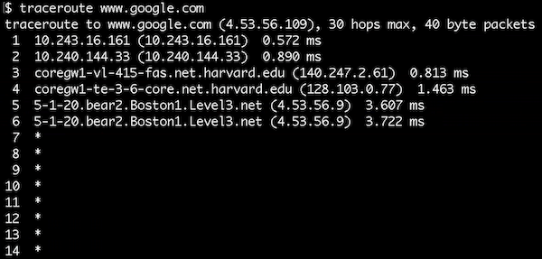
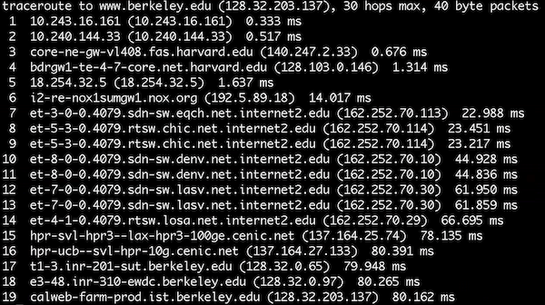
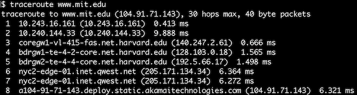
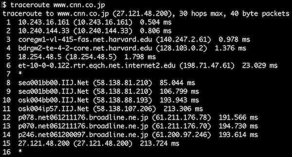

# Internet
{:.no_toc}

* TOC
{:toc}

## Pengantar
- Kita menggunakan internet setiap hari dan memiliki akses dan konektivitas yang konstan
- Jaringan rumah

  

  - Modem kabel, modem DSL, atau perangkat internet fiber
    - Terhubung ke internet
    - Bayar bulanan ke ISP (Internet Service Provider)
      - Telkom, Biznet, ICON+, dsb.
    - Mungkin terdapat konektivitas nirkabel bawaan untuk perangkat Anda
      - Mungkin membutuhkan router rumah tambahan
        - Perangkat terhubung ke router melalui kabel atau wifi

## IP

- Setiap komputer di internet memiliki alamat IP (Internet Protocol)
  - Dalam bentuk #.#.#.#
    - Empat angka terpisah oleh titik dengan nilai antara 0-255
    - Format IP address lainnya juga ada saat ini
  - Seperti alamat pos, mereka secara unik mengidentifikasi komputer di internet
    - Perangkat apa pun yang terhubung ke internet memiliki alamat IP
      - Memungkinkan komputer lain berbicara dengannya
- ISP menetapkan alamat IP ke komputer Anda (router)
  - Dulu dikonfigurasi secara fisik
  - DHCP (Dynamic Host Configuration Protocol)
    - Perangkat lunak yang disediakan ISP untuk memungkinkan komputer Anda meminta alamat IP
    - Server DHCP merespons dengan alamat IP tertentu untuk rumah Anda
  - Beberapa perangkat dapat terhubung ke jaringan rumah Anda
    - Router rumah mendukung DHCP dan memberikan alamat IP ke perangkat Anda

## DNS

- Kita mengakses situs web menggunakan nama domain (Facebook.com, Google.com, dll.), tetapi ternyata situs-situs ini juga memiliki alamat IP
- Server DNS (Domain Name System) mengubah nama domain menjadi alamat IPaddresses

## Packets

- Komputer berkomunikasi dengan mengirim paket, yang seperti amplop virtual yang dikirim antar komputer
  - Masih dalam bentuk 0 dan 1
- Bandwidth (diukur dalam bit per detik) dari suatu jaringan menentukan jumlah maksimum data yang dapat dikirim dalam jumlah waktu yang tetap. Anda dapat memeriksa bandwidth jaringan Anda dengan mengunjungi [speedtest.net] (https://www.speedtest.net/).
- Sebagai analogi, misalkan kita ingin mencari gambar kucing di internet
- Jadi, kami mengirim permintaan ke server, misalnya Google, seperti "berikan kucing.jpg"
  - Kita menempatkan permintaan ini dalam amplop
- Di amplop, kita mencantumkan IP sebagai alamat pengirim
- Namun, untuk penerima permintaan, kita tidak tahu alamat IP untuk Google
  - Harus mengandalkan DNS
  - Kirim permintaan ke server DNS ISP Anda untuk alamat IP Google
    - Jika server DNS ISP tidak mengetahui alamat IP suatu situs web, mereka akan menanyakan ke server DNS lainnya
    - Terdapat *root server* yang tahu kemana harus mencari alamat IP
- Setelah mengirim permintaan, kita akan mendapatkan respons beberapa milisecond berikutnya

  

- Kucing akan dikirim kembali dalam satu paket atau lebih
  - Jika gambar kucing terlalu besar untuk satu amplop, mengirimkannya dalam satu paket dapat menghabiskan lalu lintas internet
  - Untuk mengatasi ini, Google akan membagi gambar kucing menjadi fragmen yang lebih kecil
    - Masukkan fragmen ke dalam amplop yang berbeda
    - Tulis informasi pada amplop
      - Alamat pengirim: Alamat IP Google
      - Alamat pengiriman: Alamat IP kita
      - Sebutkan jumlah paket pada setiap amplop (1 dari 4, 2 dari 4, dll.)

## TCP/IP

- IP lebih dari sekedar alamat
  - Kesepakatan yang diikuti komputer dan server untuk memungkinkan komunikasi
- Fragmentasi seperti pada contoh amplop didukung oleh IP
  - Jika melewatkan suatu paket, Anda dapat secara logis menyimpulkan paket mana yang Anda lewatkan berdasarkan yang diterima
    - Namun, IP tidak memberi tahu komputer apa yang harus dilakukan dalam kasus ini
- TCP (*Transmission Control Protocol*) memastikan paket dapat sampai ke tujuannya
  - Biasa digunakan dengan IP (TCP/IP)
  - Mendukung nomor urut yang membantu data mencapai tujuannya
    - Saat kehilangan paket, komputer dapat membuat permintaan untuk paket yang hilang
    - Komputer akan menyatukan paket untuk mendapatkan seluruh file
  - Juga termasuk aturan untuk jenis layanan (pengidentifikasi port)
    - Untuk memastikan Google tahu kita meminta halaman web dan bukan email atau layanan lainnya

## Ports

- Berdasarkan TCP, dunia telah mementukan standar angka yang mewakili layanan yang berbeda
- Jika 5.6.7.8 adalah alamat IP Google, 5.6.7.8:80 (port 80) memberitahukan kita bahwa kita menginginkan halaman web
  - 80 artinya http (hypertext transfer protocol)
    - Bahasa yang digunakan server web
  - Google akan mengirimkan permintaan ke server web mereka melalui http
- Banyak situs web menggunakan koneksi aman dengan SSL atau HTTPS, yang menggunakan port 443
- Sertifikat SSL ini memvalidasi kunci enkripsi yang digunakan dalam komunikasi aman. Mereka biasanya dikeluarkan oleh otoritas sertifikat.
- Email menggunakan port 25
- Port lain juga ada

## Protocols

- Protokol hanyalah seperangkat aturan
  - Manusia menggunakan ini sepanjang waktu, seperti protokol untuk bertemu orang: berjabat tangan
- Ketika permintaan dibuat ke Google untuk gambar, HTTP memberi tahu Google bagaimana merespons dengan tepat
- World wide web adalah aplikasi yang digunakan untuk melihat halaman web, program, dan file yang menggunakan protokol HTTP. Halaman web ini diawali dengan `http://www`.
- World wide web menggunakan internet, yang merupakan sistem yang jauh lebih besar yang terdiri dari banyak jaringan, menghubungkan jutaan komputer.

## UDP

- User Datagram Protocol
  - Tidak menjamin keberhasilan pengiriman
  - Digunakan untuk *Video Call* seperti di WhatsApp
    - Paket dapat dijatuhkan untuk menjaga agar percakapan terus mengalir
  - Digunakan kapan saja Anda ingin menerima data tanpa menunggu buffer terisi

## IPs in More Detail

- Alamat IP terbatas
  - Dalam format #.#.#.#, setiap angka adalah 8 bit, jadi total 32 bit
    - Menghasilkan 232 atau sekitar 4 miliar kemungkinan alamat
      - Kita kehabisan alamat untuk semua komputer
  - Versi alamat saat ini adalah IPv4
  - Bergerak menuju IPv6
    - Menggunakan 128 bit, menghasilkan 2128 kemungkinan alamat
- Bagaimana Anda menemukan alamat IP Anda?
- On a Mac, go to system preferences an poke around a bit

  

- Private addresses exist
  - 10.#.#.#, 192.168.#.#, or 172.16.#.#
  - Only with special configuration can someone talk to your computer
  - Your personal device is not a server, so people should not need to access them directly
    - Your device needs to request data from servers
  - Even email is stored on a server such as Gmail and your device makes a request to that server to access that email
- Looking at advanced settings...

  

  - Subnet mask is used to decide if another computer is on the same network
  - Router (aka Gateway) has its own address
    - Routs data in different directions
- On windows:

  

  - Shows DNS servers as well

## Routers

- Router memiliki banyak kabel yang keluar dan masuk
  - Mereka memiliki tabel besar berisi alamat IP dan kemana data harus diarahkan untuk sampai ke tujuan
    - Seringkali, data dialihkan ke beberapa router berikutnya
- Tujuan router adalah untuk mengirim data ke arah tujuan
  - Router selanjutnya akan mengirimkannya ke yang lain hingga mencapai tujuan

  

- Internet adalah gabungan dari berbagai jaringan (dengan routernya masing-masing) yang didesain agar skalanya mudah ditingkatkan. Skalabilitas adalah kapasitas sistem untuk berubah ukuran dan skala untuk memenuhi tuntutan baru.
  - Seringkali beberapa cara untuk beralih dari A ke B untuk menciptakan sistem yang lebih toleran terhadap kesalahan, ini disebut redundansi jaringan.
    - Berdasarkan logika Militer AS untuk mencegah putus koneksi saat router tertentu mati
    - Ketika beberapa paket dikirim, seperti cat.jpg dari Google, mereka masing-masing dapat mengambil jalur yang berbeda, akhirnya sampai di tujuan
      - Terkadang internet sibuk dan jalur tercepat berubah
    - Memiliki banyak jalur dari A ke B

## Traceroute

- How long does it take for this process of data transfer to take on the internet?
- Traceroute is a program that sends packets to each router on a path to a destination, reporting the time it takes to reach that router
- From Sanders Theatre to Google.com:

  

  - 1-2: A few unnamed routers at Harvard
  - 3-4: More Harvard routers
  - 5-6: Level3 is a ISP
  - 7+: The routers are denying the request
- From Sanders Theatre to Berkeley.edu

  

  - 6: Northern Crossroads
  - 7-14: A fast connection
    - 8-9: Chicago
    - 10-11: Denver
    - 12-13: Las Vegas
    - 14: Los Angeles
  - 19 is where it arrives at Berkeley in 80 ms!

- From Sanders Theatre to MIT.edu

  

  - 6-7: Goes to New York connectivity
  - 8: MIT's website is outsourced to Akamai's NYC servers

- From Sanders Theatre to CNN.jp

  

  - 9-10 jumps from Seattle to Osaka past an ocean!
    - Using undersea cabling

## Kabel Bawah Laut

- Guru memperlihatkan video tentang kabel bawah laut

  <iframe src="https://www.youtube.com/embed/IlAJJI-qG2k"></iframe>

## Demo Modem Kabel

- Guru memperlihatkan modem kabel rumah, dengan fokus pada port-portnya
  - Koneksi telepon (RJ11)
  - Empat soket kabel ethernet (RJ45)
    - Berbagai perangkat dapat terhubung ke sini untuk konektivitas internet
  - Modem ini memiliki wifi didalamnya

## Demo Switch Jaringan

- Guru memperlihatkan switch jaringan
  - Perangkat yang dapat Anda pasang ke router Anda untuk memungkinkan lebih banyak koneksi untuk semua perangkat Anda yang lain

## Demo Router Rumah

- Guru memperlihatkan router rumah
- Router rumah mungkin memiliki wifi, firewall, dan switch dalam satu perangkat yang sama

## Demo Kabel Jaringan

- Guru memotong kabel ethernet hingga terbuka bagian dalam
- Di dalam kabel jaringan terdapat 8 kawat berbeda-beda warna
  - Beberapa digunakan untuk mengirim data, lainnya untuk menerima data
  - Lainnya untuk isolasi dan penolak interferensi

## AP CSP Terminology

- __Computing device__: a physical artifact that can run a program
- __Computing system__: a group of computing devices and programs working together for a common purpose
- __Computing network__: a computing system that contains a group of interconnected computing devices capable of sending and receiving data.
- __Path__: a sequence of directly connected computing devices that begins and ends at the receiver.
