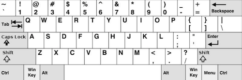
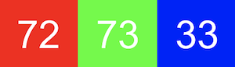
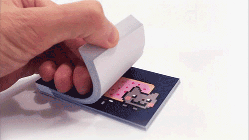
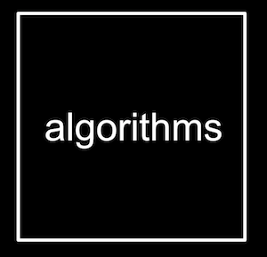
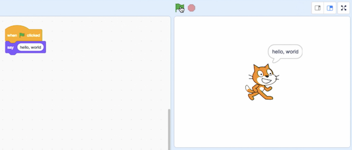
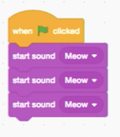
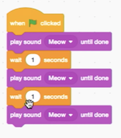
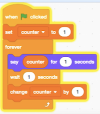
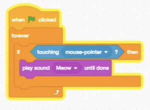
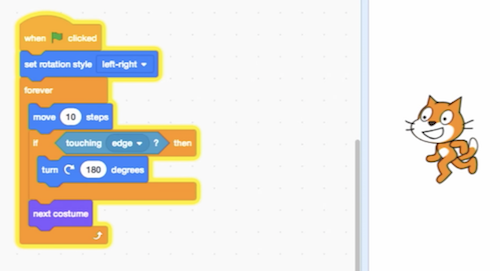

## Computational Thinking & Scratch
{:.no_toc}

* TOC
{:toc}

## Apa itu ilmu komputer?

* Ilmu komputer pada dasarnya adalah pemecahan masalah, dan pemrograman individual atau (lebih mungkin) secara kolaboratif adalah salah satu cara untuk melakukannya.
* Kolaborasi adalah aspek penting dari pemecahan masalah. Caranya dapat berupa berbagai bentuk, seperti komunikasi atau konsultasi. Kolaborasi membantu kita melihat beragam perspektif, yang dapat membantu kita menghindari bias dalam pengembangan inovasi komputasi.
* Kita dapat menganggap pemecahan masalah sebagai proses mengambil beberapa input (detail tentang masalah kita) dan menghasilkan beberapa output (solusi untuk masalah kita). "Kotak hitam" di tengah adalah apa yang secara bertahap akan kita pelajari lebih banyak dalam mata pelajaran ini. <br>
  
* Kita membutuhkan cara untuk mewakili input dengan cara standar, dan jika masalah kita menghitung jumlah orang di ruang kelas, kita akan memiliki banyak pilihan. Kita bisa menulis tally di papan tulis, atau menggunakan tangan kita. Faktanya, hanya dengan satu tangan, kita dapat menggunakan jari kita secara kreatif: hanya dengan ibu jari kita, kita bisa mewakili satu; dengan jari telunjuk kita yang lurus ke atas, kita bisa mewakili dua; dengan ibu jari dan jari telunjuk kita ke atas, kita bisa mewakili tiga. Dan dengan terus menggunakan pola permutasi, kita bisa mewakili 32 nilai berbeda hanya dengan lima jari!

## Binary

* Komputer, pada level terendah, menyimpan data dalam biner, di mana hanya ada dua digit, 0 dan 1. Dan itu memetakan bagaimana komputer kita menggunakan listrik, yang mudah dimatikan atau dinyalakan.
* Sebagai manusia, kita tahu yang berikut ini mewakili seratus dua puluh tiga.
  ```
  1 2 3
  ```
  * `3` ada di kolom satuan,` 2` ada di kolom puluhan, dan `1` ada di kolom ratusan.
  * Jadi `123` adalah 100×1 + 10×2 + 1×3 = 100 + 20 + 3 = 123.
* Dalam biner, dengan hanya dua digit, kami memiliki kekuatan dua untuk setiap posisi angka:
  <pre>
  4 2 1
  <b>0 0 0</b>
  </pre>
  * Ini masih sama dengan 0.
* Sekarang jika kita mengubah nilai biner menjadi, katakanlah, `0 1 1`, nilai desimalnya adalah 3.
  <pre>
  4 2 1
  <b>0 1 1</b>
  </pre>
* Dengan cukup _bits_, atau _binary digits_, komputer dapat menghitung jauh lebih tinggi.
* Untuk mewakili huruf, yang perlu kita lakukan hanyalah memutuskan bagaimana angka dipetakan ke huruf. Beberapa manusia, bertahun-tahun yang lalu, secara kolektif memutuskan pemetaan standar yang disebut [ASCII] (https://en.wikipedia.org/wiki/ASCII). Huruf "A", misalnya, adalah angka 65, dan "B" adalah 66, dan seterusnya.
  * Sebuah byte sama dengan 8 bit, dan kita menggunakannya sebagai unit untuk mengelola bit. Angka 72, misalnya, muat kedalam satu byte.
* Dan program komputer tahu, berdasarkan konteks kodenya, apakah angka biner harus ditafsirkan sebagai angka, atau huruf, atau bahkan media lain.

## Merepresentasikan data

* **Abstraksi** adalah konsep dalam ilmu komputer di mana beberapa implementasi tingkat rendah (seperti bagaimana data akhirnya disimpan dalam biner) disederhanakan atau diterima begitu saja, sehingga kita dapat menggunakan implementasi itu pada tingkat yang lebih tinggi (seperti mewakili huruf, yang kemudian dapat kita gunakan dalam program kita).
* Pada keyboard standar Amerika, tidak tersedia huruf dengan tanda aksen, dan banyak simbol serta karakter lainnya:
  
* Untuk mengatasi masalah itu, komputer dapat mewakili huruf dengan standar selain ASCII.
* Ternyata kedua huruf dengan tanda aksen, serta emoji, dapat direpresentasikan sebagai karakter dengan banyak byte, dengan standar yang disebut [Unicode](https://en.wikipedia.org/wiki/Unicode) (satu versi spesifik yang disebut UTF-8).
  
  
  * Ketika kita menerima emoji, komputer kita sebenarnya hanya menerima angka desimal seperti `128514` (`11111011000000010` dalam biner, jika Anda dapat membacanya dengan lebih mudah) yang kemudian dipetakan ke gambar emoji.
* Komputer juga dapat menggunakan biner untuk mewakili gambar. Dengan tiga byte, masing-masing mewakili sejumlah warna merah, hijau, dan biru, kami dapat mewakili jutaan warna:<br>
  
  * Nilai merah, hijau, dan biru digabungkan untuk mendapatkan warna kuning muda:<br>
    
* Setiap gambar terdiri dari ribuan atau jutaan piksel, atau kotak-kotak warna, yang dapat kita lihat begitu kita memperbesar cukup jauh:
  
* Dan video hanyalah banyak, banyak gambar yang ditampilkan satu demi satu, pada sejumlah bingkai per detik. Kumpulan gambar tersebut menciptakan ilusi gerakan.
  * Untuk mendemonstrasikan bagaimana video bekerja, kita bisa melihat flipbook.
  
* Pada iPhone yang lebih baru, fitur "Animoji" hanyalah kumpulan gambar, dihasilkan dan ditampilkan satu demi satu:
  
* Kita dapat menganggap video sebagai abstraksi atas gambar, gambar sebagai abstraksi atas piksel, dan piksel sebagai abstraksi atas bit.

## Algoritma

* Jadi sekarang kita dapat mewakili input dan output. Input dan output dapat muncul dalam berbagai bentuk, seperti sentuhan, audio, visual, atau teks. Kotak hitam sebelumnya akan berisi *algoritma*, petunjuk langkah demi langkah untuk menyelesaikan masalah:<br>
  
* Katakanlah kita ingin mencari teman, Ucup, di buku telepon.
  * Kita dapat mulai dengan membalik-balik buku, tiap satu halaman, sampai kita menemukan ucup atau mencapai akhir buku.
  * Kita juga bisa membalik dua halaman sekaligus, tetapi jika kita melangkah terlalu jauh, kita harus mundur satu halaman.
  * Tetapi cara yang paling efisien adalah membuka buku telepon ke tengah, memutuskan apakah Ucup akan berada di setengah kiri atau kanan buku (karena buku itu disusun menurut abjad), dan segera membuang setengah dari masalahnya. Kita bisa mengulanginya, membagi masalahnya menjadi dua bagian setiap kali.
* Faktanya, kita dapat mewakili efisiensi dari masing-masing algoritma tersebut dengan grafik:<br>
  
  * Solusi pertama kita, satu halaman pada satu waktu, seperti garis merah: waktu yang kita butuhkan meningkat secara linear seiring dengan meningkatnya ukuran masalah.
  * Solusi kedua, dua halaman sekaligus, seperti garis kuning: kemiringannya tidak securam sebelumnya, tetapi masih linier.
  * Solusi terakhir kita, seperti garis hijau: logaritmik, karena waktu kita untuk menyelesaikan naik lebih lambat seiring dengan meningkatnya ukuran masalah. Dengan kata lain, jika buku telepon bertambah dari 1000 menjadi 2000 halaman, kita  hanya perlu satu langkah lagi untuk menemukan Ucup. Jika ukurannya dua kali lipat lagi dari 2000 menjadi 4000 halaman, kita masih hanya perlu satu langkah lagi.
* Secara naluriah, kita tahu bagaimana menyelesaikan masalah ini karena kami telah menjumpainya dalam kehidupan sehari-hari, tetapi bagaimana jika kita tidak melakukannya? Kita dapat berpikir tentang menyelesaikan masalah atau merancang program dengan strategi yang berbeda, termasuk tetapi tidak terbatas pada:
  * brainstorming
  * perencanaan dan storyboarding
  * mengatur masalah menjadi beberapa komponen atau bagian dan menyelesaikan masing-masing secara modular
  * membuat diagram atau diagram alir
  * mengembangkan serangkaian tes untuk memeriksa apakah program Anda melakukan tugas yang diinginkan
* Penting untuk menyelidiki beberapa solusi berdasarkan kendala masalah untuk menemukan solusi yang paling efisien untuk pengguna yang diinginkan. Beberapa metode untuk investigasi adalah:
  * mengumpulkan data melalui survei
  * pengujian pengguna
  * mewawancarai calon pengguna
  * pengamatan langsung
* Mewawancarai calon pengguna memainkan peran besar dalam proses pengembangan karena mereka dapat membantu memberikan banyak perspektif yang mungkin tidak dipikirkan pengembang.

## Pseudocode

*Kita dapat menulis _pseudocode_, suatu sintaks informal versi bahasa Inggris yang lebih spesifik (atau bahasa manusia lainnya) yang mewakili algoritma kita:
  <pre>
   0 pick up phone book
   1 open to middle of phone book
   2 look at names
   3 if Smith is among names
   4     call Mike
   5 else if Smith is earlier in book
   6     open to middle of left half of book
   7     go back to step 2
   8 else if Smith is later in book
   9     open to middle of right half of book
  10     go back to step 2
  11 else
  12     quit
  </pre>
* Beberapa baris ini dimulai dengan kata kerja, atau tindakan. Kita akan mulai memanggil ini _fungsi_:
  <pre>
   0 <b>pick up</b> phone book
   1 <b>open to</b> middle of phone book
   2 <b>look at</b> names
   3 if Smith is among names
   4     <b>call</b> Mike
   5 else if Smith is earlier in book
   6     <b>open</b> to middle of left half of book
   7     go back to step 2
   8 else if Smith is later in book
   9     <b>open</b> to middle of right half of book
  10     go back to step 2
  11 else
  12     <b>quit</b>
  </pre>
* Kita juga memiliki pertanyaan yang mengarah ke jalur yang berbeda, seperti persimpangan jalan, yang akan kita sebut _condition_:
  <pre>
   0 pick up phone book
   1 open to middle of phone book
   2 look at names
   3 <b>if</b> Smith is among names
   4     call Mike
   5 <b>else if</b> Smith is earlier in book
   6     open to middle of left half of book
   7     go back to step 2
   8 <b>else if</b> Smith is later in book
   9     open to middle of right half of book
  10     go back to step 2
  11 <b>else</b>
  12     quit
  </pre>
* Dan jawaban atas pertanyaan yang menentukan ke mana kita pergi disebut *Boolean expressions*, yang akhirnya menghasilkan nilai benar atau salah:
  <pre>
   0 pick up phone book
   1 open to middle of phone book
   2 look at names
   3 if <b>Smith is among names</b>
   4     call Mike
   5 else if <b>Smith is earlier in book</b>
   6     open to middle of left half of book
   7     go back to step 2
   8 else if <b>Smith is later in book</b>
   9     open to middle of right half of book
  10     go back to step 2
  11 else
  12     quit
  </pre>
* Akhirnya, kita memiliki kata-kata yang mengarah ke pengulangan, di mana kita dapat mengulangi potongan dari program kita, yang disebut _loops_:
  <pre>
   0 pick up phone book
   1 open to middle of phone book
   2 look at names
   3 if Smith is among names
   4     call Mike
   5 else if Smith is earlier in book
   6     open to middle of left half of book
   7     <b>go back to step 2</b>
   8 else if Smith is later in book
   9     open to middle of right half of book
  10     <b>go back to step 2</b>
  11 else
  12     quit
  </pre>

## Scratch

* Kita dapat menulis program dengan fondasi yang baru saja kita temukan:
  * _functions_
  * _conditions_
  * _Boolean expressions_
  * _loops_
* Kita akan menggunakan bahasa pemrograman grafis yang disebut [Scratch](https://scratch.mit.edu/), di mana kita akan menggunakan balok seperti puzzle yang berisi instruksi.
* Dalam pelajaran kita selanjutnya, kita akan pindah ke bahasa pemrograman tekstual seperti C, dan Python, dan JavaScript. Semua bahasa ini, termasuk Scratch, memiliki fitur yang lebih kuat seperti:
  * variables
    * kemampuan untuk menyimpan nilai dan mengubahnya
  * threads
    * kemampuan program kita untuk melakukan banyak hal sekaligus
  * events
    * kemampuan untuk merespons perubahan dalam program atau input kita
  * ...
* Aplikasi yang didemokan di kelas adalah [Oscartime](https://scratch.mit.edu/projects/76196420/), yang kita mainkan dengan seorang _volunteer_. Game ini melibatkan mengklik dan menarik sampah yang jatuh dari atas layar:<br>
  
  * Kita sudah dapat mulai menguraikan program untuk game:
    * Animasi tempat sampah adalah urutan 3 gambar, ditampilkan satu demi satu.
    * Skor disimpan dalam variabel, dan meningkat dengan setiap potongan sampah yang kita seret.
* _Environment_ pemrograman untuk Scratch terlihat seperti ini:<br>
  
  * Di sebelah kiri, kita memiliki potongan puzzle yang mewakili fungsi atau variabel, atau konsep lain, yang dapat kita seret dan lepas ke area instruksi di tengah.
  * Di sebelah kanan, kita memiliki _stage_ yang akan ditunjukkan oleh program kita kepada manusia, di mana kita dapat menambah atau mengubah latar belakang, karakter (disebut _sprite_ dalam Scratch), dan banyak lagi.
* Kita dapat menyeret beberapa blok untuk membuat Scratch mengatakan _"hello, world"_:<br>
  
  * Blok _"when green flag clicked"_ adalah awal dari program kita, dan di bawahnya kkita telah mengambil blok _"say"_ dan mengetik _"hello, world_".
* Kita juga dapat menyeret blok _"ask and wait"_, dengan pertanyaan seperti "Siapa namamu?", Dan gabungkan dengan blok _"say"_ untuk jawabannya:<br>
  
* Kita dapat menggunakan blok "join" untuk menggabungkan dua frasa sehingga Scratch dapat mengatakan "hello, Dimas":<br>
  
  * Perhatikan bahwa kita dapat menyusun instruksi dan variabel di dalam lingkaran bertumpuk-tumpuk.
* Kita bisa mencoba membuat Scratch (nama kucing) berkata meow:<br>
  
  * Tetapi ketika kita mengklik bendera hijau, kita hanya mendengar suara meow sekali. Bug, atau kesalahan, pertama kita! Ternyata komputer dapat melakukan banyak hal dengan sangat cepat, jadi ia membaca setiap blok, mulai memutar suara, dan pindah ke blok berikutnya tanpa jeda. Jadi ketiga "meow" tumpang tindih dan terdengar seperti satu suara.
* Kita dapat memperbaikinya dengan _"play sound until done"_, dan bahkan _"wait"_ sebelum kita mengatakan meow lagi:<br>
  
* Kita dapat menyalin dan menempel blok ini berulang kali, tetapi program kita dapat memiliki desain yang lebih baik jika kita menggunakan loop, seperti blok "forever":<br>
  
* Kita punya program lain, [counting sheep](https://scratch.mit.edu/projects/26329219/):<br>
  
  * Di sini, _"counter"_ adalah variabel tempat kita menyimpan nilai, dan menambahkannya setiap kali domba kita mengatakannya.
* Kita dapat mengotak-atik blok lain, dan membuat Scratch mengeong ketika kita "membelai" dia dengan pointer mouse kita:<br>
  
  * Kita membutuhkan blok _"forever"_ karena, jika tidak, program kita akan memeriksa pernyataan kondisi itu di awal, dan kemudian berhenti.
* Kita juga dapat menggunakan blok _"if else"_ untuk memutar suara yang berbeda tergantung kondisinya.
* Dengan beberapa blok lagi, kita dapat membuat Scratch bergerak di layar, kiri dan kanan:<br>
  
* Dan jika kita mencari beberapa gambar Scratch dengan kakinya di berbagai posisi, kita bahkan dapat mensimulasikan berjalan:<br>
  
  * Di tab lain yang disebut _"Costumes"_, kita dapat mengatur seperti apa Scratch di setiap frame. Animasi hanyalah versi yang lebih kompleks dari ini.
* Dengan menjelajahi blok apa yang kita miliki, kita dapat meminta Scratch untuk mengikuti kita dengan blok seperti _"point toward mouse cursor"_.
* Kita juga dapat memiliki beberapa skrip, atau potongan kode, dalam program yang sama:<br>
  
  * Dengan tombol spasi, kita dapat mengubah nilai variabel yang disebut _"muted"_, dan skrip kedua akan memutar suara atau tidak tergantung pada nilai "muted".
* Denagn events, kita dapat memiliki dua _sprite_, masing-masing dengan skrip masing-masing, berinteraksi satu sama lain:<br>
  <br>
  
  * Kita menempatkan set blok ini pada sprite yang berbeda, dan sekarang ketika kita mengklik bendera hijau, yang satu mengatakan "Marco" dan yang lain mengatakan "Polo" dengan sendirinya!
* Satu tanda program yang dirancang dengan buruk adalah tanda di mana kita menyalin dan menempel kode yang sama berulang kali. Singkatan dari DRY, atau _"Don't Repeat Yourself"_, adalah pengingat yang baik. Misalnya, alih-alih menduplikasi blok yang sama, kita dapat menggunakan blok "ulangi" untuk melakukan sesuatu berulang kali.
* Langkah selanjutnya adalah mengabstraksi beberapa kode kita menjadi suatu fungsi. Kita dapat membuat blok yang disebut "cough" dan meletakkan beberapa blok di dalamnya:<br>
  
  * Sekarang, semua sprite kita dapat menggunakan blok "cough" yang sama, di tempat sebanyak yang kita inginkan.
* Kita bahkan dapat memasukkan berapa kali pengulangan yang diinginkan ke dalam fungsi batuk kita, jadi kita hanya perlu satu blok untuk batuk berapa kali:<br>
  
* Karena kita menggunakan bahasa pemrograman tingkat tinggi, kita akan melihat lebih banyak contoh tentang bagaimana koleksi kode yang ditulis oleh orang lain, yang disebut _libraries_, akan berguna bagi kita untuk menulis program kita sendiri.
* Kita memainkan lebih banyak contoh permainan interaktif, yang ditulis oleh siswa sekolah lain.