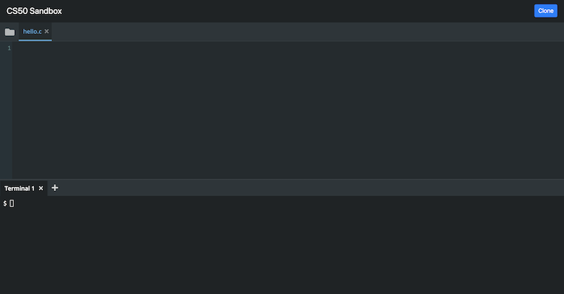
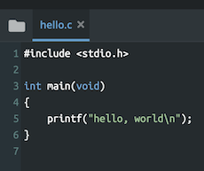
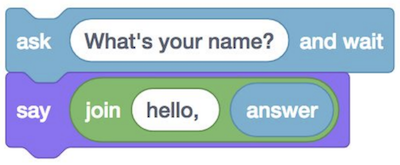
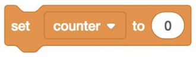
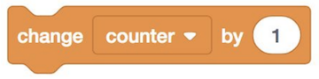
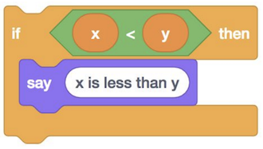
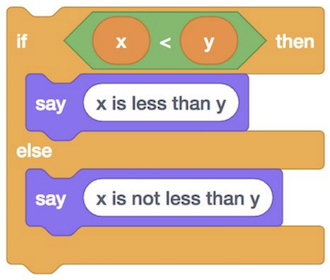
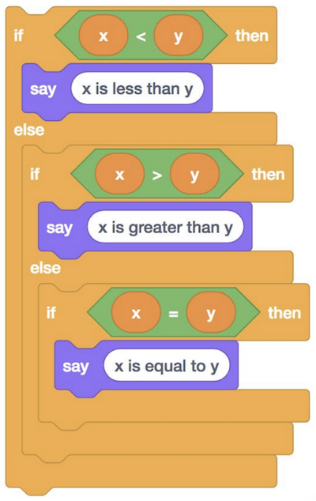
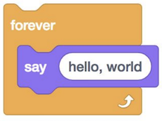
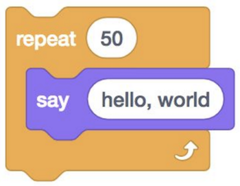

# C
{:.no_toc}

* TOC
{:toc}

## Mengenal C

* Hari ini kita akan belajar sebuah bahasa baru, **C**: bahasa pemrograman yang memiliki seluruh fitur Scratch dan banyak lagi, tapi mungkin sedikit rumit karena murni teks.

    ```C
    #include <stdio.h>

    int main(void)
    {
        printf("hello, world\n");
    }
    ```

  * Meskipun kata-katanya baru, idenya persis sama dengan blok "ketika bendera hijau diklik" dan "katakan (hello, world)" di Scratch:

    

* Meskipun penuh keanehan, tidak perlu takut! Dan meskipun pada awalnya, meminjam frasa dari MIT, mencoba menyerap semua konsep baru ini mungkin terasa seperti minum dari selang kebakaran, yakinlah bahwa pada akhir tahun kita akan menguasai serta mendapatkan manfaatnya.

* Kita dapat membandingkan banyak konstruksi dalam C dengan blok yang telah kita lihat dan gunakan di Scratch. Meskipun sintaksnya berbeda, namun mereka memiliki prinsip yang mirip dengan apa yang telah kita pelajari.

## hello, world

* Blok "ketika bendera hijau diklik" di Scratch memulai program utama; mengklik bendera hijau menyebabkan blok yang berada tepat di bawahnya berjalan. Dalam C, baris pertama untuk hal yang sama adalah `int main (void)`, yang akan kita pelajari lebih lanjut selama beberapa minggu mendatang, diikuti oleh kurung kurawal buka `{`, dan kurung kurawal tutup `}`, membungkus semua yang menjadi bagian dari program kita.

    ```C
    int main(void)
    {

    }
    ```

* Blok "say (hello, world)" adalah fungsi, dan dipetakan ke `printf("hello, world");`. Dalam C, fungsi untuk menprint sesuatu ke layar adalah `printf`, di mana `f` berarti "format", artinya kita dapat memformat *string* yang diprint dengan cara yang berbeda. Kemudian, kita menggunakan tanda kurung untuk menyampaikan apa yang ingin kita print. Kita harus menggunakan tanda kutip ganda untuk mengelilingi teks kita sehingga dipahami sebagai teks, dan akhirnya, kita menambahkan tanda titik koma `;` untuk mengakhiri baris kode ini.

* Untuk membuat program kita berfungsi, kita juga memerlukan baris lain di atas, baris header `#include <stdio.h>` yang mendefinisikan fungsi `printf` yang ingin kita gunakan. Di suatu tempat ada file di komputer kita, `stdio.h`, yang mencakup kode yang memungkinkan kita untuk mengakses fungsi `printf`, dan baris `#include` memberitahu komputer untuk memasukkan file itu ke program kita.

* Untuk menulis program pertama kita di Scratch, kita membuka situs web Scratch. Demikian pula, kita akan menggunakan [CS50 Sandbox](https://sandbox.cs50.io/) untuk mulai menulis dan menjalankan kode dengan cara yang sama. CS50 Sandbox, yang dikembangkan oleh Harvard University, adalah lingkungan virtual berbasis cloud dengan berbagai *library* dan *tools* yang sudah diinstal untuk menulis program dalam berbagai bahasa. Di bagian atas, ada editor kode sederhana, di mana kita bisa mengetik teks. Di bawahnya, kita memiliki jendela terminal, di mana kita dapat mengetik perintah:

    

* Kita coba mengetikkan kode berikut, setelah menggunakan tanda `+` untuk membuat file baru bernama `hello.c`:

    

* Mengikuti konvensi yang ada, kita mengakhiri file program kita dengan `.c` untuk menunjukkan bahwa itu dimaksudkan sebagai program C. Perhatikan bahwa kode kita diwarnai, sehingga hal-hal tertentu lebih terlihat.

## *Compiler*

* Setelah kita menyimpan kode yang kita tulis, yang disebut ***source code***, kita perlu mengubahnya menjadi ***machine code***, instruksi biner yang dimengerti komputer secara langsung.

* Kita menggunakan program yang disebut ***compiler*** untuk mengkompilasi *source code* kita ke dalam *machine code*.

* Untuk melakukan ini, kita menggunakan panel ***Terminal***, yang memiliki ***command prompt***. `$` di sebelah kiri adalah *prompt*, dan kita bisa mengetik perintah di sebelahnya.

  * Kita mengetikkan `clang hello.c` (di mana `clang` singkatan dari *"C language"*, sebuah kompiler yang ditulis oleh sekelompok orang). Tetapi sebelum kita menekan enter, kita klik ikon folder di kiri atas CS50 Sandbox. Kita melihat file kita, `hello.c`. Tekan enter di jendela terminal, dan lihat kita memiliki file lain sekarang, yang disebut `a.out` (kependekan dari *"assembly output"*). Di dalam file itu adalah kode untuk program kita, dalam biner. Sekarang, kita bisa mengetikkan `./a.out` di terminal prompt untuk menjalankan program `a.out` di folder kita saat ini. Kita baru saja menulis, menyusun, dan menjalankan program pertama kita!

## *String*

* Tetapi setelah kita menjalankan program kita, kita melihat `hello, world$`, dengan *prompt* baru pada baris yang sama dengan output kita. Ternyata kita perlu menentukan secara detil bahwa kita memerlukan baris baru setelah program kita, sehingga kita dapat memperbarui kode kita untuk memasukkan karakter spesial baris baru, `\n`:

    ```C
    #include <stdio.h>

    int main(void)
    {
        printf("hello, world\n");
    }
    ```

  * Sekarang kita harus ingat untuk mengkompilasi ulang program kita dengan `clang hello.c` sebelum kita dapat menjalankan versi baru ini.

* Baris 2 program kita sengaja dikosongkan karena kita ingin memulai bagian kode baru, seperti memulai paragraf baru dalam esai. Ini tidak diharuskan untuk menjalankan program kita dengan benar, tetapi membantu manusia membaca program yang lebih panjang dengan lebih mudah.

* Kita dapat mengubah nama program kita dari `a.out` menjadi nama yang lain juga. Kita dapat memberikan ***coomand-line arguments***, atau opsi tambahan, ke program di terminal, tergantung pada apa yang dimengerti oleh program. Sebagai contoh, kita bisa mengetikkan `clang -o hello hello.c`, dan `-o hello` memberitahu program `clang` untuk menyimpan output yang dikompilasi sebagai `hello`. Lalu, kita bisa menjalankan `./hello`.

* Di *command promt* kita, kita dapat menjalankan perintah lain, seperti `ls` *(list)*, yang memperlihatkan file-file di folder kita saat ini:

    ```bash
    $ ls
    a.out* hello* hello.c
    ```

  * Tanda bintang, `*`, menunjukkan bahwa file-file itu dapat dieksekusi, atau dapat dijalankan oleh komputer kita.

* Kita dapat menggunakan perintah `rm` *(remove)* untuk menghapus file:

    ```bash
    $ rm a.out
    rm: remove regular file 'a.out'?
    ```

  * Kita dapat mengetikkan `y` atau `yes` untuk mengonfirmasi, dan menggunakan `ls` lagi untuk melihat bahwa itu memang hilang selamanya.

* Sekarang, mari kita coba untuk mendapatkan input dari pengguna, seperti yang kita lakukan di Scratch ketika kita ingin mengatakan "hello, Dimas":

    

    ```C
    string answer = get_string("What's your name?\n");
    printf("hello, %s\n", answer);
    ```

  * Pertama, kita membutuhkan `string`, atau potongan teks (khususnya, nol atau lebih karakter beurutan dalam tanda kutip ganda, seperti `""`, `"ba"`, atau `"pisang"`), yang dapat kita tanyakan kepada pengguna, dengan fungsi `get_string`. Kami menyampaikan *prompt*, atau apa yang ingin kita tanyakan kepada pengguna, ke fungsi tersebut dengan "What is your name?\n" di dalam tanda kurung. Di sebelah kiri, kita ingin membuat variabel, `answer`, nilai yang akan menjadi apa yang dimasukkan pengguna. (Tanda sama dengan = mengatur nilai dari kanan ke kiri.) Akhirnya, tipe variabel yang kita inginkan adalah `string`, jadi kita tentukan itu di sebelah kiri `answer`.

  * Selanjutnya, di dalam fungsi `printf`, kita ingin nilai `answer` dalam apa yang kita *print* kembali. Kita menggunakan *placeholder* untuk variabel *string* kita, `%s`, di dalam frasa yang ingin kita *print*, seperti `"hello, %s\n"`, dan kemudian kita memberikan `printf` argumen lain, atau opsi, untuk memberi tahunya bahwa kita ingin menggantinya dengan variabel `answer`.

* Jika kita melakukan kesalahan, seperti menulis `printf("hello, world"\n);` dengan `\n` di luar tanda kutip ganda, kita akan melihat *error* dari kompiler kita:

    ```bash
    $ clang -o hello hello.c
    hello.c:5:26: error: expected ')'
        printf("hello, world"\n);
                            ^
    hello.c:5:11: note: to match this '('
        printf("hello, world"\n);
            ^
    1 error generated.
    ```

  * Baris pertama dari *error* memberitahu kita untuk melihat `hello.c`, baris 5, kolom 26, di mana kompiler mengharapkan tanda kurung penutup, bukannya backslash.

* Untuk menyederhanakan banyak hal (setidaknya di awal), kita akan menyertakan *library*, atau set kode, dari CS50. *Library* tersebut memberi kita tipe variabel `string`, fungsi `get_string`, dan banyak lagi. Kita hanya perlu menulis sebuah baris di atas untuk `include` file `cs50.h`:

    ```C
    #include <cs50.h>
    #include <stdio.h>

    int main(void)
    {
        string name = get_string("What's your name?\n");
        printf("hello, name\n");
    }
    ```

* Jadi mari kita buat file baru, `string.c`, dengan kode ini:

    ```C
    #include <stdio.h>

    int main(void)
    {
        string name = get_string("What's your name?\n");
        printf("hello, %s\n", name);
    }
    ```

* Sekarang, jika kita mencoba mengkompilasi kode itu, kita mendapatkan banyak baris *error*. Terkadang, satu kesalahan menyebabkan kompiler kemudian mulai menafsirkan kode yang benar dengan salah, menghasilkan lebih banyak *error* daripada yang sebenarnya terjadi. Jadi kita mulai dengan kesalahan pertama kita:

    ```bash
    $ clang -o string string.c
    string.c:5:5: error: use of undeclared identifier 'string'; did you mean 'stdin'?
    string name = get_string("What's your name?\n");
    ^~~~~~
    stdin
    /usr/include/stdio.h:135:25: note: 'stdin' declared here
    extern struct _IO_FILE *stdin;          /* Standard input stream.  */
    ```

  * Yang kita inginkan memang `string`, bukan `stdin` *("standard in")* seperti yang disarankan oleh *compiler*, sehingga pesan *error* tersebut tidak membantu. Faktanya, kita perlu mengimpor file lain yang mendefinisikan tipe `string` (yang akan kita ketahui dalam beberapa minggu mendatang).

* Jadi kita bisa memasukkan file lain, `cs50.h`, yang juga mencakup fungsi `get_string`, diantara sekian banyak lainnya.

    ```C
    #include <cs50.h>
    #include <stdio.h>

    int main(void)
    {
        string name = get_string("What's your name?\n");
        printf("hello, %s\n", name);
    }
    ```

* Sekarang, ketika kita mencoba untuk mengkompilasi program kita, kita hanya memiliki satu kesalahan:

    ```bash
    $ clang -o string string.c
    /tmp/string-aca94d.o: In function `main':
    string.c:(.text+0x19): undefined reference to `get_string'
    clang-7: error: linker command failed with exit code 1 (use -v to see invocation)
    ```

  * Ternyata kita juga harus memberi tahu kompiler kita untuk menambahkan file *library* khusus CS50 kita, dengan `clang -o string string.c -lcs50`, dengan `-l` untuk *"link"*.

* Kita bahkan dapat mengabstraksikan ini dan cukup ketik `make string`. Kita melihat bahwa, secara default di CS50 Sandbox, `make` menggunakan `clang` untuk mengkompilasi kode kita dari `string.c` ke dalam `string`, dengan memasukkan semua argumen, atau *flag*, yang diperlukan.

## Blok Scratch dalam C

* Blok “set [counter] to (0)” membuat sebuah variabel, dan dalam C kita akan menulis `int counter = 0;`, di mana `int` menetapkan bahwa tipe variabel kita adalah *integer*:

    

    ```C
    int counter = 0;
    ```

* “change [counter] by (1)” adalah `counter = counter + 1;` dalam C. (Dalam C, = tidak seperti tanda sama dengan dalam matematika, di mana kita mengatakan `counter` sama dengan `counter + 1`. Sebaliknya, `=` adalah ***assignment operator*** yang berarti, “salin nilai di sebelah kanan, ke dalam nilai di sebelah kiri”.) Dan perhatikan kita tidak perlu mengatakan `int` lagi, karena kita menganggap bahwa kita sudah menentukan sebelumnya bahwa `counter` adalah `int`, dengan nilai tertentu yang sudah ada. Kita juga bisa mengatakan `counter += 1;` atau `counter++;` keduanya adalah *"syntactic sugar"*, atau pintasan yang memiliki efek yang sama dengan karakter yang lebih sedikit untuk diketik.

    

    ```C
    counter = counter + 1;
    ```

    ```C
    counter += 1;
    ```

    ```C
    counter++
    ```

* Suatu kondisi akan dipetakan ke:

    

    ```C
    if (x < y)
    {
        printf("x is less than y\n");
    }
    ```

  * Perhatikan bahwa dalam C, kita menggunakan `{` dan `}` (serta indentasi, atau tab) untuk menunjukkan bagaimana baris kode harus dikumpulkan.

* Kkita juga dapat memiliki kondisi *if-else*:

    

    ```C
    if (x < y)
    {
        printf("x is less than y\n");
    }
    else
    {
        printf("x is not less than y\n");
    }
    ```

  * Perhatikan bahwa baris kode yang bukan tindakan (`if...`, dan kurung kurawal) tidak diakhiri dengan tanda titik koma.

* Dan bahkan `else if`:

    

    ```C
    if (x < y)
    {
        printf("x is less than y\n");
    }
    else if (x > y)
    {
        printf("x is greater than y\n");
    }
    else if (x == y)
    {
        printf("x is equal to y\n");
    }
    ```

  * Perhatikan bahwa, untuk membandingkan dua nilai dalam C, kita menggunakan `==`, dua tanda sama dengan.

  * Dan, secara logis, kita tidak memerlukan `if (x == y)` dalam kondisi akhir, karena hanya itulah satu-satunya kemungkinan yang tersisa, dan kita bisa cukup mengatakan `else`.

    ```C
    if (x < y)
    {
        printf("x is less than y\n");
    }
    else if (x > y)
    {
        printf("x is greater than y\n");
    }
    else
    {
        printf("x is equal to y\n");
    }
    ```

* *Loop* dapat ditulis seperti berikut:

    

    ```C
    while (true)
    {
        printf("hello, world\n");
    }
    ```

  * Kata kunci `while` juga memerlukan kondisi, jadi kita menggunakan `true` sebagai *Boolean expression* untuk memastikan bahwa perulangan kita akan berjalan selamanya. Program kita akan memeriksa apakah ekspresi bernilai `true` (yang selalu akan terjadi dalam kasus ini), dan kemudian jalankan baris di dalam kurung kurawal. Program akan diulangi sampai ekspresi tidak lagi `true` (yang tidak akan berubah dalam kasus ini).

* Kita bisa melakukan sesuatu beberapa kali dengan `while`:

    

    ```C
    int i = 0;
    while (i < 50)
    {
        printf("hello, world\n");
        i++;
    }
    ```

  * Kita membuat variabel, `i`, dan mengaturnya ke 0. Kemudian, ketika `i < 50`, kita menjalankan beberapa baris kode, dan kita menambahkan 1 ke `i` setelah setiap kali dijalankan.

  * Kurung kurawal di sekitar dua baris di dalam *loop* `while` menunjukkan bahwa baris-baris itu akan berulang, dan kita dapat menambahkan baris tambahan ke program kita setelahnya jika kita mau.

* Untuk melakukan pengulangan yang sama, lebih umum kita dapat menggunakan kata kunci `for`:

    ```C
    for (int i = 0; i < 50; i++)
    {
        printf("hello, world\n");
    }
    ```

  * Sekali lagi, pertama kita buat variabel bernama `i` dan atur ke 0. Lalu, kita periksa bahwa `i < 50` setiap kali kita mencapai bagian atas loop, sebelum kita menjalankan salah satu kode di dalamnya. Jika ekspresinya *true*, maka kita menjalankan kode di dalamnya. Akhirnya, setelah kita menjalankan kode di dalamnya, kita menggunakan `i++` untuk menambahkan 1 ke `i`, dan loop berulang kembali.

## *Type*, *format*, *operator*

* Ada tipe lain yang bisa kita gunakan untuk variabel kita
  * `bool`, ekspresi Boolean antara `true` atau `false`
  * `char`, satu karakter seperti `a` atau `2`
  * `float`, nilai *floating-point*, atau bilangan real dengan nilai desimal
  * `double`, nilai *floating-point* dengan angka lebih banyak lagi
  * `int`, bilangan bulat hingga ukuran, atau jumlah bit, tertentu
  * `long`, bilangan bulat dengan lebih banyak bit, sehingga mereka dapat menghitung lebih tinggi
  * `string`, rangkaian karakter
* Dan *library* CS50 memiliki fungsi-fungsi untuk mendapatkan input dari berbagai jenis data:
  * `get_char`
  * `get_float`
  * `get_double`
  * `get_int`
  * `get_long`
  * `get_string`
* Untuk `printf`, juga, ada *placeholder* berbeda untuk setiap jenis data:
  * `%c` untuk `char`
  * `%f` untuk `float`, `double`
  * `%i` untuk `int`
  * `%li` untuk `long`
  * `%s` untuk `string`
* Dan ada beberapa operator matematika yang bisa kita gunakan:
  * `+` untuk pertambahan
  * `-` untuk pengurangan
  * `*` untuk perkalian
  * `/` untuk pembagian
  * `%` untuk sisa

## Contoh lainnya

* Untuk masing-masing contoh ini, Anda dapat mengklik [tautan *sandbox*]({{ "/chapter/4" | relative_url }}) untuk menjalankan dan mengedit salinannya sendiri.

* Di `int.c`, kita `get` dan `print` bilangan bulat:

    ```C
    #include <cs50.h>
    #include <stdio.h>

    int main(void)
    {
        int age = get_int("What's your age?\n");
        int days = age * 365;
        printf("You are at least %i days old.\n", days);
    }
    ```

  * Perhatikan bahwa kita menggunakan `%i` untuk mem*print* sebuah *integer*.

  * Kita sekarang dapat menjalankan `make int` dan menjalankan program kita dengan `./int`.
  
  * Kita dapat menggabungkan baris dan menghapus variabel hari dengan:

    ```C
    int age = get_int("What's your age?\n");
    printf("You are at least %i days old.\n", age * 365);
    ```

  * Atau bahkan menggabungkan semuanya dalam satu baris:

    ```C
    printf("You are at least %i days old.\n", get_int("What's your age?\n") * 365);
    ```

  * Namun, setelah satu baris terlalu panjang atau rumit, mungkin lebih baik menyimpan dua atau bahkan tiga baris seperti di awal agar mudah dibaca.

* Di `float.c`, kita bisa mendapatkan angka desimal (disebut nilai *floating-point* di komputer, karena titik desimal dapat "mengambang" di antara digit, tergantung pada angka):

    ```C
    #include <cs50.h>
    #include <stdio.h>

    int main(void)
    {
        int price = get_float("What's the price?\n");
        printf("Your total is %f.\n", price * 1.1);
    }
    ```

  * Sekarang, jika kita *compile* dan menjalankan program di atas, kita akan melihat harga yang di*print* dengan pajak.
  
  * Kita dapat menentukan jumlah digit yang dicetak setelah desimal dengan *placeholder* seperti `%.2f` untuk dua digit setelah titik desimal.

* Dengan `parity.c`, kita dapat memeriksa apakah suatu bilangan genap atau ganjil:

    ```C
    #include <cs50.h>
    #include <stdio.h>

    int main(void)
    {
        int n = get_int("n: ");

        if (n % 2 == 0)
        {
            printf("even\n");
        }
        else
        {
            printf("odd\n");
        }
    }
    ```

  * Dengan operator `%` (modulo), kita bisa mendapatkan sisa `n` setelah dibagi dengan 2. Jika sisanya adalah 0, kita tahu bahwa `n` adalah genap. Kalau tidak, kita tahu `n` adalah ganjil.

  * Dan fungsi seperti `get_int` dari *library* CS50 melakukan pengecekan kesalahan, di mana hanya input dari pengguna yang cocok dengan tipe yang kita inginkan yang diterima.

* Di `conditions.c`, kita mengubah potongan kondisi dari sebelumnya menjadi program:

    ```C
    // Conditions and relational operators

    #include <cs50.h>
    #include <stdio.h>

    int main(void)
    {
        // Prompt user for x
        int x = get_int("x: ");

        // Prompt user for y
        int y = get_int("y: ");

        // Compare x and y
        if (x < y)
        {
            printf("x is less than y\n");
        }
        else if (x > y)
        {
            printf("x is greater than y\n");
        }
        else
        {
            printf("x is equal to y\n");
        }
    }
    ```

  * Baris yang dimulai dengan `//` adalah komentar, atau catatan bagi manusia yang  akan *compiler* abaikan.

* Di `agree.c`, kita dapat meminta pengguna untuk mengonfirmasi atau menolak sesuatu:

    ```C
    // Logical operators

    #include <cs50.h>
    #include <stdio.h>

    int main(void)
    {
        // Prompt user to agree
        char c = get_char("Do you agree?\n");

        // Check whether agreed
        if (c == 'Y' || c == 'y')
        {
            printf("Agreed.\n");
        }
        else if (c == 'N' || c == 'n')
        {
            printf("Not agreed.\n");
        }
    }
    ```

  * Kita menggunakan dua bilah vertikal, `||`, untuk menunjukkan logika "atau", apakah salah satu dari kedua ekspresi itu `true`.

  * Dan jika tidak ada ekspresi yang benar, tidak ada yang akan terjadi karena program kita tidak memiliki loop.

* Mari kita implementasikan program `cough` pada pertemuan sebelumnya:

    ```C
    #include <stdio.h>

    int main(void)
    {
        printf("cough\n");
        printf("cough\n");
        printf("cough\n");
    }
    ```

* Kita dapat menggunakan *loop* `for`:

    ```C
    #include <stdio.h>

    int main(void)
    {
        for (int i = 0; i < 3; i++)
        {
            printf("cough\n");
        }
    }
    ```

  * Secara konvensi, programmer cenderung mulai menghitung dari 0, sehingga `i` akan memiliki nilai `0`, `1`, dan `2` sebelum berhenti, dengan total tiga iterasi, atau pengulangan. Kita juga bisa menulis `for (int i = 1, i <= 3, i++)` untuk efek akhir yang sama.

* Kita dapat memindahkan baris `printf` ke fungsinya sendiri:

    ```C
    #include <stdio.h>

    void cough(void);

    int main(void)
    {
        for (int i = 0; i < 3; i++)
        {
            cough();
        }
    }

    void cough(void)
    {
        printf("cough\n");
    }
    ```

  * Kita mendeklarasikan fungsi baru dengan `void cough(void);`, sebelum fungsi `main` kita memanggilnya. *Compiler* C membaca kode kita dari atas ke bawah, jadi kita perlu memberitahukannya bahwa fungsi `cough` ada, sebelum kita menggunakannya. Kemudian, setelah fungsi `main` kita, kita dapat menerapkan fungsi `batuk`. Dengan cara ini, *compiler* mengetahui fungsi itu ada, dan kita bisa menjaga fungsi `main` kita tetap dekat ke atas.

  * Dan fungsi `cough` kita tidak mengambil input apa pun, jadi kita menulis `cough(void)`.

* Kita bisa mengabstraksi `cough` lebih lanjut:

    ```C
    #include <stdio.h>

    void cough(int n);

    int main(void)
    {
        cough(3);
    }

    void cough(int n)
    {
        for (int i = 0; i < n; i++)
        {
            printf("cough\n");
        }
    }
    ```

  * Sekarang, ketika kita ingin mencetak "cough" beberapa kali, kita bisa memanggil fungsi yang sama. Perhatikan bahwa, dengan `void cough(int n)`, kita mengindikasikan bahwa fungsi `cough` mengambil sebuah input dalam tipe `int`, yang kita sebut sebagai `n`. Dan di dalam `cough`, kita menggunakan `n` pada loop `for` kita untuk mem*print* *"cough"* beberapa kali.

* Let’s look at `positive.c`:

    ```C
    #include <cs50.h>
    #include <stdio.h>

    int get_positive_int(string prompt);

    int main(void)
    {
        int i = get_positive_int("Positive integer: ");
        printf("%i\n", i);
    }

    // Prompt user for positive integer
    int get_positive_int(string prompt)
    {
        int n;
        do
        {
            n = get_int("%s", prompt);
        }
        while (n < 1);
        return n;
    }
    ```

  * *Library* CS50 tidak memiliki fungsi get_positive_int, tetapi kita dapat menulisnya sendiri. Fungsi `int get_positive_int(string prompt)` akan mengambil `string` yang disebut `prompt` untuk ditampilkan kepada pengguna, dan mengembalikan `int`, yang disimpan oleh fungsi `main` kita sebagai `i`. Di `get_positive_int`, kita menginisialisasi variabel, `int n`, tanpa memberikan nilai padanya. Kemudian, kita memiliki konstruksi baru, `do ... while`, yang melakukan sesuatu *terlebih dahulu*, lalu memeriksa suatu kondisi, dan mengulangi sampai kondisinya tidak lagi `true`.

  * Setelah loop berakhir karena kita memiliki `n` yang bukan `< 1`, kita dapat mengembalikannya dengan kata kunci `return`. Dan kembali ke fungsi utama kita, kita dapat mengatur `int i` ke nilai tersebut.

### Layar

* Kita mungkin menginginkan program yang mencetak sebagian layar dari *video game* seperti Super Mario Bros. Di `mario0.c`, kita memiliki:

    ```C
    // Prints a row of 4 question marks

    #include <stdio.h>

    int main(void)
    {
        printf("????\n");
    }
    ```

* Kita dapat meminta sejumlah tanda tanya kepada pengguna, dan kemudian mem*print*nya, dengan `mario2.c`:

    ```C
    #include <cs50.h>
    #include <stdio.h>

    int main(void)
    {
        int n;
        do
        {
            n = get_int("Width: ");
        }
        while (n < 1);
        for (int i = 0; i < n; i++)
        {
            printf("?");
        }
        printf("\n");
    }
    ```

* Dan kita dapat mencetak satu set blok dua dimensi dengan `mario8.c`:

    ```C
    // Prints an n-by-n grid of bricks with a loop

    #include <cs50.h>
    #include <stdio.h>

    int main(void)
    {
        int n;
        do
        {
            n = get_int("Size: ");
        }
        while (n < 1);
        for (int i = 0; i < n; i++)
        {
            for (int j = 0; j < n; j++)
            {
                printf("#");
            }
            printf("\n");
        }
    }
    ```

  * Perhatikan bahwa kita memiliki dua *loop* bercabang, di mana *loop* luar menggunakan `i` untuk melakukan segala sesuatu dalam `n` kali, dan *loop* bagian dalam menggunakan `j`, variabel yang berbeda, untuk melakukan sesuatu `n` kali untuk setiap waktu *tersebut*. Dengan kata lain, *loop* luar mencetak `n` "baris", dan *loop* dalam mencetak `n` "kolom", atau karakter `#`, di setiap baris.

* Contoh lain yang tidak dicakup dalam pertemuan tersedia di bawah "Source Code" untuk [Chapter 4]({{ "/chapter/4" | relative_url }}).

## *Memory*, *imprecision*, dan *overflow*

* Komputer kita memiliki memori, dalam chip perangkat keras yang disebut RAM, *random-access memory*. Program kita menggunakan RAM itu untuk menyimpan data saat dijalankan, tetapi memori itu terbatas. Jadi dengan jumlah bit terbatas, kita tidak dapat mewakili semua angka yang memungkinkan (yang jumlahnya tidak terbatas). Jadi komputer kita memiliki sejumlah bit terbatas untuk setiap `float` dan `int`, dan harus membulatkannya ke nilai desimal terdekat pada titik tertentu.

* Dengan `floats.c`, kita bisa melihat apa yang terjadi ketika kita menggunakan `float`:

    ```C
    #include <cs50.h>
    #include <stdio.h>

    int main(void)
    {
        // Prompt user for x
        float x = get_float("x: ");

        // Prompt user for y
        float y = get_float("y: ");

        // Perform division
        printf("x / y = %.50f\n", x / y);
    }
    ```

  * Dengan `%50f`, kita dapat menentukan jumlah tempat desimal yang ditampilkan.

  * Hmm, sekarang kita mendapatkan ...

    ```bash
    x: 1
    y: 10
    x / y = 0.10000000149011611938476562500000000000000000000000
    ```

  * Ternyata ini disebut ***floating-point imprecision***, di mana kita tidak memiliki bit yang cukup untuk menyimpan semua nilai yang memungkinkan, sehingga komputer harus menyimpan nilai terdekat dari 1 dibagi 10.

* Kita dapat melihat masalah serupa di `overflow.c`:

    ```C
    #include <stdio.h>
    #include <unistd.h>

    int main(void)
    {
        for (int i = 1; ; i *= 2)
        {
            printf("%i\n", i);
            sleep(1);
        }
    }
    ```

  * Di loop `for` kita, kita menetapkan `i` ke `1`, dan menggandakannya dengan `*= 2`. (Dan kita akan terus melakukan ini selamanya, jadi tidak ada kondisi yang kita periksa.)
  
  * Kita juga menggunakan fungsi `sleep` dari `unistd.h` untuk membuat program kita berhenti sejenak setiap setelah menprint nilai `i`.
  
  * Sekarang, ketika kita menjalankan program ini, kita melihat jumlahnya semakin besar, sampai:

    ```bash
    1073741824
    overflow.c:6:25: runtime error: signed integer overflow: 1073741824 * 2 cannot be represented in type 'int'
    -2147483648
    0
    0
    ...
    ```

  * Ternyata, program kita mengakui bahwa *signed integer* (*integer* dengan tanda positif atau negatif) tidak dapat menyimpan nilai berikutnya, dan mengeluarkan *error*. Kemudian, karena mencoba menggandakannya, `i` menjadi angka negatif, dan kemudian 0.

  * Masalah ini disebut ***integer overflow***, di mana *integer* sangat besar sebelum akhirnya kehabisan bit dan "berguling". Kita dapat menggambarkan menambah 1 ke 999 dalam desimal. Digit terakhir menjadi 0, kita membawa 1 sehingga digit berikutnya menjadi 0, dan kita mendapatkan 1000. Tetapi jika kita dibatasi hanya memiliki tiga digit, kita akan berakhir dengan 000 karena tidak ada tempat untuk menempatkan 1 terakhir!

* Masalah Y2K muncul karena banyak program menyimpan tahun kalender hanya dengan dua digit, seperti 98 untuk tahun 1998, dan 99 untuk tahun 1999. Tetapi ketika tahun 2000 mendekat, program-program itu akan menyimpan 00, yang menyebabkan kebingungan antara tahun 1900 dan 2000.

* Sebuah pesawat Boeing 787 juga memiliki bug di mana penghitung di generator mengalami *integer overflow* setelah 248 hari operasi berkelanjutan, karena jumlah detik yang telah berjalan tidak dapat lagi disimpan di *counter* pada program didalamnya.

* Jadi, kita telah melihat beberapa masalah yang bisa terjadi, tetapi sekarang mengerti mengapa, dan bagaimana mencegahnya.

* Dengan *problem set 1*, kita akan menggunakan CS50 Lab, yang dibangun di atas CS50 Sandbox, untuk menulis beberapa program.
